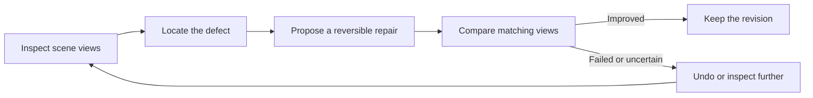

# Clean Room Imputation

**An agent-driven repair loop for captured 3D spaces.** Inspect a room, repair broken furniture and collision geometry, then check the result from multiple viewpoints.

Built for CoreWeave Hacks with **W&B Inference, W&B Weave, fal, Three.js, and Spark**.

## The demo

Explore an office reconstruction and switch between its original and repaired geometry without changing your viewpoint. The demonstrated repairs rebuild a folding table and two chairs, remove floating reconstruction debris, and update the corresponding collision geometry.

- **Move around:** drag to look, WASD to move, Q/E to change elevation, or use the on-screen buttons.
- **Compare:** toggle Before repair / After repair in the live 3D scene.
- **Inspect geometry:** switch between Collision mesh and Textured view.
- **Understand the loop:** expand the short explanation below the viewer.

With the local demo data installed, open **http://127.0.0.1:8000/**.

## The repair loop



A model verdict is evidence, not ground truth. The workflow retains source references, camera poses, rejected candidates, and accepted revisions so decisions can be reviewed and changes reversed.

## W&B Inference and Weave

**W&B Inference** runs GLM-5.3-Flash for visual observations, tool selection, and before/after evaluation in the implemented agent workflows.

**W&B Weave** records model and tool calls, reviewed images, outputs, usage, and evaluation decisions. These traces help explain what the agent inspected, why it proposed an edit, and whether that edit passed its checks. Weave provides observability; it does not certify reconstruction accuracy.

Recorded examples include the [restoration pipeline](https://wandb.ai/s-rekaitai/clean-room-imputation/r/call/01a09bd0-d315-7801-9562-d8473b8055f5) and [furniture repair review](https://wandb.ai/s-rekaitai/clean-room-imputation/r/call/01a09c29-918d-7315-b341-8345512beb11). These links require access to the W&B project. The latest foreground-debris cleanup has local evidence and revision records; it was not added to Weave.

## What is implemented

| Component | Role |
| --- | --- |
| Three.js + Spark | Interactive mesh and Gaussian-splat rendering, scene revisions, and collider inspection |
| FastAPI + Python | Scene storage, capture tools, model adapters, and checkpointed workflows |
| W&B Inference + Weave | Model execution, visual review, and traceable agent decisions |
| fal | Segmentation, object reconstruction, and Hunyuan room generation |
| Geometry tools | Alignment, local mesh cleanup, paired splat/collider transforms, and reversible edits |

The repository includes a bounded model-driven inspection/edit/evaluation loop. The demonstrated furniture reconstruction and latest cleanup were **assistant-led tool work**, not an unattended run of that deployed loop. See the [repair record](docs/direct-office-repair.md) for the actual accepted and rejected attempts.

The current office uses a **Hunyuan room with reconstructed furniture splats**. Marble adapters are included, but the office demo is not a completed Marble world. Background distortion and inferred floor geometry remain. Navigation is free flight; collision visualization does not establish validated physics or a simulation-ready digital twin.

## Run locally

Requires **Node.js 22.12+**, **Python 3.11+**, and **uv**. Install Google Chrome if you will use headless scene capture or the browser checks.

```sh
npm ci
uv sync
cp .env.example .env
```

Configure the private `.env`:

| Variable | Purpose |
| --- | --- |
| `WANDB_API_KEY` | W&B Inference and Weave authentication |
| `WANDB_ENTITY`, `WANDB_PROJECT` | Destination for Weave traces |
| `CLEANROOM_WEAVE=true` | Enable Weave tracing |
| `FAL_KEY` | Paid segmentation, image, and reconstruction tools |
| `CLEANROOM_DATA_DIR` | Local scene assets and recorded evidence; defaults to `./data` |
| `CLEANROOM_VIEWER_URL` | URL used by headless capture; use `http://127.0.0.1:8000` for the single-server setup below |

Viewing saved results does not start model jobs. Provider keys are needed when running the corresponding model tools.

```sh
npm run build
uv run uvicorn backend.app:app --host 127.0.0.1 --port 8000
```

**Office media, generated assets, and recorded demo data are not included in this public repository.** A fresh clone needs a local data package to replay the office demo. To work with your own assets, follow the [import and agent workflow instructions](docs/agent-runbook.md), then open the workspace at `http://127.0.0.1:8000/?workspace=1`.

For frontend development, run `npm run dev` alongside the backend. The development viewer uses port 5173.

## Verify

```sh
uv run pytest -q
npm run build
```

With the local office data and server available:

```sh
node scripts/demo-check.mjs
node scripts/direct-office-check.mjs
```

The browser checks exercise movement, revision comparison, and presentation controls. They do not measure physical reconstruction accuracy.

## Documentation

- [Demo guide](docs/demo.md) — controls, scope, and presentation operation.
- [Repair record](docs/direct-office-repair.md) — actual experiments, evidence, and limitations.
- [Agent runbook](docs/agent-runbook.md) — imports, tools, tracing, and replay; historical checkpoints are labeled.
- [Build brief](docs/build-brief.md) — project intent and evaluation constraints.
- [Agent instructions](AGENTS.md) — provenance, isolation, and reversible-edit requirements.

Credentials, private media, generated assets, and local artifacts stay outside Git.
